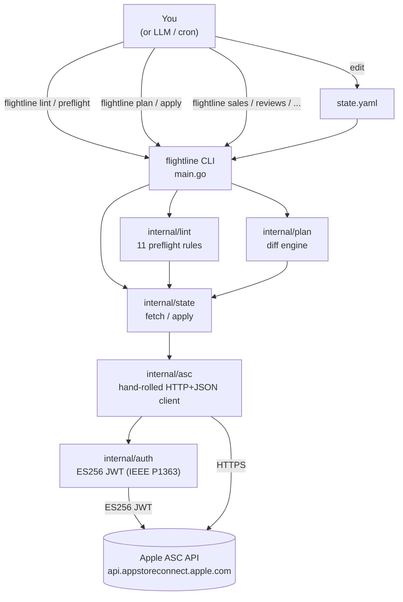

<div align="center">

# Flightline

**App Store as Code.**

The first declarative tool for App Store Connect: fetch live state, edit YAML, lint, plan, apply.

[](https://github.com/ul0gic/flightline/actions/workflows/ci.yml)
[](LICENSE)
[](https://pkg.go.dev/github.com/ul0gic/flightline)
[](https://goreportcard.com/report/github.com/ul0gic/flightline)
[](https://go.dev/doc/go1.26)

</div>

Like Terraform for cloud infrastructure, Flightline manages your App Store presence as declarative state. A single Go binary fetches live App Store Connect state into YAML, runs preflight checks against Apple's rejection rules, and applies changes idempotently. The same tool reads sales, analytics, reviews, subscription state, beta feedback, and performance metrics from the terminal. The ASC web UI becomes optional.

MIT licensed, contributions welcome ([CONTRIBUTING.md](CONTRIBUTING.md)). No SaaS layer, no telemetry, no accounts. Just a binary that talks to Apple's API.

---

## Table of Contents

- [Install](#install)
- [Setup](#setup)
- [Quickstart](#quickstart)
- [Why Flightline](#why-flightline)
- [The lifecycle](#the-lifecycle)
- [What it does today](#what-it-does-today-v001-pre)
- [Architecture](#architecture)
- [Commands by category](#commands-by-category)
- [Output](#output)
- [Configuration precedence](#configuration-precedence)
- [What it doesn't do](#what-it-doesnt-do)
- [Documentation](#documentation)
- [Development](#development)
- [Status](#status)
- [License](#license)

---

## Install

```bash
go install github.com/ul0gic/flightline@latest
```

Requires Go 1.26+. App Store Connect work requires a Mac, so that's where Flightline is meant to run (Apple Silicon and Intel both supported); the binary itself builds anywhere Go does.

Verify:

```bash
flightline --version
```

To compile from a checkout instead:

```bash
git clone https://github.com/ul0gic/flightline.git
cd flightline
make build
./bin/flightline --version
```

A Homebrew tap will follow once the project is released. Full details in [docs/getting-started/install.md](docs/getting-started/install.md).

---

## Setup

Flightline authenticates with an App Store Connect API key (a `.p8` private key it signs an ES256 JWT with), not your Apple ID. One-time setup:

1. **Generate a key.** App Store Connect > Users and Access > Integrations > App Store Connect API > **+**. Grant role **App Manager** (or **Admin** for finance reports). Click **Generate**, then **Download API Key**: the `.p8` downloads only once. Note the **Key ID** and **Issuer ID**.
2. **Place the key.** Move it to `~/.appstoreconnect/AuthKey_<KEY_ID>.p8` and `chmod 600` it. Flightline refuses a `.p8` with wider permissions and prints the exact fix.
3. **Export credentials.** In `~/.zshrc` (or `~/.bashrc`):

   ```bash
   export APP_STORE_CONNECT_KEY_ID="ABCD1234EF"
   export APP_STORE_CONNECT_ISSUER_ID="12345678-90ab-cdef-1234-567890abcdef"
   export APP_STORE_CONNECT_VENDOR_NUMBER="12345678"   # sales/finance only
   ```

4. **Verify.** Run `flightline whoami`; `AUTHORIZED true` means you are set.

Full walkthrough (roles, 401/403 troubleshooting, flag and config-file alternatives): [docs/getting-started/apple-api-key.md](docs/getting-started/apple-api-key.md).

---

## Quickstart

```bash
# Verify auth
flightline whoami

# List your apps
flightline apps list

# Inspect a version
flightline versions get com.under5.passdmv --version 1.0

# Diagnose a rejection (if the version is in REJECTED state)
flightline rejection com.under5.passdmv --version 1.0

# Run offline preflight against a state file
flightline lint state.yaml
```

Replace `com.under5.passdmv` with your bundle ID. For the full fetch, edit, plan, apply walkthrough, see [docs/guides/state-as-code.md](docs/guides/state-as-code.md).

---

## Why Flightline

Every other modern platform has "as Code" tooling. The App Store doesn't. Until now.

| Tool | Domain | "as Code" for |
|---|---|---|
| Terraform | AWS, GCP, Azure, on-prem | Infrastructure |
| Pulumi | Cloud + Kubernetes | Infrastructure |
| Helm | Kubernetes | Releases |
| **Flightline** | **App Store Connect** | **App Store** |

App Store Connect has two failure modes that cost real time.

**Authoring failures.** Hundreds of fields scattered across a dozen surfaces: version metadata, IAPs, review screenshots, age rating, export compliance, privacy labels, demo credentials, per-locale localizations, build attachment. Forget any one and the release gets bounced. Every rejection is a lost release cycle.

**Observation friction.** Sales, reviews, subscription churn, beta crashes, performance metrics, each on a different ASC web surface, none piped, none scriptable.

Flightline addresses both. The authoring half lets you declare release state in YAML next to your app source, diff it against live ASC state, and apply changes idempotently. The observation half gives you composable terminal commands you can pipe to `jq`, feed to LLM prompts, or cron-schedule as snapshots.

---

## The lifecycle

### Authoring (stop getting rejected)

```mermaid
flowchart LR
    A["1. fetch\nread live state"] --> B["2. edit\nstate.yaml"]
    B --> C["3. lint\noffline check"]
    C --> D["4. plan\ndiff vs live"]
    D --> E["5. preflight\nlive rule check"]
    E --> F["6. apply --confirm\nidempotent writes"]
    F --> G["7. submit\ntestflight beta-review submit"]
    G --> H["8. rejection\ndiagnose if bounced"]

    classDef readonly fill:#e8f5e9,stroke:#388e3c,color:#1b5e20
    classDef write fill:#fff8e1,stroke:#f9a825,color:#3e2723
    classDef commit fill:#fce4ec,stroke:#c62828,color:#b71c1c

    class A,C,D,E,H readonly
    class B write
    class F,G commit
```



Steps 1 to 5 are read-only and reversible. Step 6 patches ASC but does not submit for review. Step 7 (beta-review submit) is the only action that triggers Apple Review, and it requires explicit confirmation.

### Observation (stop opening the web UI)

```bash
flightline sales com.under5.passdmv --days 30
flightline finance com.under5.passdmv --month 2026-04
flightline reviews summary com.under5.passdmv
flightline analytics request com.under5.passdmv --wait
flightline beta-feedback crash com.under5.passdmv
flightline performance app com.under5.passdmv
```

All observation commands support `--output json` for piping to `jq` or feeding to LLM prompts.

---

## What it does today (v0.0.1-pre)

All three layers are complete: L1 (API CLI), L2 (state-as-code), and L3 (preflight rules).

| Surface | L1 read | L1 write | L2 state-as-code | L3 preflight rule |
|---|:---:|:---:|:---:|:---:|
| Apps | ✅ | - | - | - |
| Versions | ✅ | ✅ | ✅ | ✅ |
| Builds (incl. attach) | ✅ | ✅ | ✅ | ✅ |
| Metadata + localizations | ✅ | ✅ | ✅ | ✅ |
| Screenshots | ✅ | ✅ | ✅ ¹ | ✅ |
| IAPs (incl. review screenshot) | ✅ | ✅ | ✅ ¹ | ✅ (3 rules) |
| Age rating | ✅ | ✅ | ✅ | ✅ |
| Export compliance | ✅ | ✅ | ✅ | ✅ |
| Reviewer demo info | ✅ | ✅ | ✅ | - |
| Categories | ✅ | ✅ | ✅ | - |
| Pricing | ✅ | ✅ | ✅ | - |
| Custom product pages | ✅ | ✅ | ✅ ¹ | - |
| TestFlight (groups, testers, beta-review submit) | ✅ | ✅ | ✅ (partial) | ✅ |
| Subscription groups | ✅ | - ² | - ² | - |
| Review submissions (App Store Review) | ✅ | - ³ | - ³ | - |
| Customer reviews | ✅ | - ⁴ | - | - |
| Beta feedback (crash + screenshot) | ✅ | - | - | - |
| Diagnostic signatures | ✅ | - | - | - |
| Performance metrics | ✅ | - | - | - |
| Sales reports | ✅ | - | - | - |
| Finance reports | ✅ | - | - | - |
| Subscription reports | ✅ | - | - | - |
| Analytics reports | ✅ | - | - | - |
| Privacy nutrition labels | portal-only ⁵ | - | - | - |

¹ Asset uploads flow through L1 verbs by design (`screenshots upload`, `iap review-screenshot upload`, `custom-product-pages screenshots upload`). Apple's multipart upload API is structurally distinct from JSON PATCH, so `apply` converges config fields and the upload verbs move asset bytes. See [docs/guides/uploading-assets.md](docs/guides/uploading-assets.md).

² Subscriptions are read-only for now. Subscription writes are deferred, with no near-term plan.

³ App Store Review submission is intentionally manual; see [What it doesn't do](#what-it-doesnt-do).

⁴ Replying to reviews is not implemented.

⁵ `appPrivacyDetails` is absent from ASC API v4.3. `flightline privacy-labels get` returns a typed `supported: false` diagnostic rather than silently failing.

---

## Architecture

Flightline is a cobra subcommand tree backed by a hand-rolled HTTP+JSON client against Apple's API. There is no codegen: Apple's OpenAPI spec triggers cascading type-name collisions in every Go generator evaluated. The spec is committed as authoritative reference and queried via `jq` during development.



**Layer stack:**

```
L3: preflight rules (internal/lint/)  ... catches clerical rejection causes
L2: state-as-code   (internal/state/) ... declare, diff, apply
L1: API CLI         (internal/asc/)   ... every ASC surface as a terminal command
```

Each layer is useful standalone. You can use `flightline sales` and `flightline reviews` without ever touching a `state.yaml`, and L3 preflight catches issues even if you manage writes manually.

---

## Commands by category

### Authoring: manage release state

```bash
# Versions
flightline versions list com.under5.passdmv
flightline versions create com.under5.passdmv --version 1.1 --copyright "2026 ..."
flightline versions update com.under5.passdmv --version 1.1 --release-type MANUAL

# Metadata and localizations
flightline metadata set com.under5.passdmv --version 1.1 \
  --locale en-US --name "PassDMV" --subtitle "..."

# Screenshots
flightline screenshots upload com.under5.passdmv --version 1.1 \
  --locale en-US --device-set APP_IPHONE_67 ./screenshots/iphone.png

# IAPs
flightline iap create com.under5.passdmv --name "Lifetime" \
  --product-id com.under5.passdmv.lifetime --type NON_CONSUMABLE

# Age rating and compliance
flightline age-rating set com.under5.passdmv --version 1.1 --from-file rating.json
flightline export-compliance set com.under5.passdmv --version 1.1 \
  --uses-non-exempt-encryption false

# Review submissions (read-only) and rejection diagnosis
flightline review-submissions items com.under5.passdmv --submission <id>
flightline rejection com.under5.passdmv --version 1.1
```

### Observation: read account state

```bash
# Customer reviews
flightline reviews list com.under5.passdmv --rating 1 --rating 2
flightline reviews summary com.under5.passdmv

# Sales, finance, and subscription reports
flightline sales com.under5.passdmv --days 30
flightline finance com.under5.passdmv --month 2026-04
flightline subscriptions reports com.under5.passdmv --type summary --range P30D

# Analytics (async: request, poll, download)
flightline analytics request com.under5.passdmv --access-type ONE_TIME_SNAPSHOT --wait
flightline analytics download com.under5.passdmv --instance <id> --out report.csv

# TestFlight feedback, crash diagnostics, performance
flightline beta-feedback crash com.under5.passdmv
flightline diagnostics list com.under5.passdmv
flightline performance app com.under5.passdmv
```

### State as Code: declare, diff, apply

```bash
# Snapshot live ASC state into a YAML file
flightline fetch com.under5.passdmv > state.yaml

# Preview what would change (no writes)
flightline plan state.yaml

# Apply changes idempotently (safe to re-run)
flightline apply state.yaml --confirm

# Resume a partially-applied run after interruption
flightline apply state.yaml --confirm --resume
```

Schema reference: [docs/reference/state-yaml.md](docs/reference/state-yaml.md). Walkthrough: [docs/guides/state-as-code.md](docs/guides/state-as-code.md).

### Preflight: catch rejections before they happen

```bash
# Offline: validates state.yaml against JSON Schema + format rules
flightline lint state.yaml

# Live: reads ASC state, runs all 11 rules, reports pass/fail
flightline preflight com.under5.passdmv --version 1.1

# Cross-check live state against a state file
flightline preflight com.under5.passdmv --version 1.1 --state-file state.yaml

# JSON output for CI integration
flightline preflight com.under5.passdmv --version 1.1 --output json | jq '.diagnostics'
```

Every rule with mode, severity, and fix hints: [docs/reference/preflight-rules.md](docs/reference/preflight-rules.md).

---

## Output

Every command supports `--output table` (default) and `--output json`.

```bash
flightline apps list --output table
```

```
BUNDLE ID                  NAME         STATUS
com.under5.passdmv         PassDMV      READY_FOR_SALE
```

```bash
flightline apps list --output json
```

```json
[
  {
    "bundleId": "com.under5.passdmv",
    "name": "PassDMV",
    "sku": "passdmv",
    "primaryLocale": "en-US"
  }
]
```

The JSON shape is a stable contract. Adding fields is backward-compatible; removing or renaming fields is a breaking change tracked by a major version bump. Sales and subscription commands additionally support `--output tsv` (passthrough from Apple's wire format).

---

## Configuration precedence

From highest to lowest priority:

1. CLI flags (`--key-id`, `--issuer-id`, etc.)
2. Environment variables (`APP_STORE_CONNECT_KEY_ID`, `APP_STORE_CONNECT_ISSUER_ID`, `APP_STORE_CONNECT_VENDOR_NUMBER`, `APP_STORE_CONNECT_KEY_PATH`, `FLIGHTLINE_*`)
3. Config file (`~/.config/flightline/config.yaml`)
4. Defaults

**Config file example** (`~/.config/flightline/config.yaml`):

```yaml
key-id: ABCD1234EF
issuer-id: 12345678-90ab-cdef-1234-567890abcdef
vendor-number: "12345678"
output: table
```

---

## What it doesn't do

**Not Fastlane.** No pipeline DSL, no build orchestration. `xcodebuild`, Xcode Cloud, and Fastlane still own compilation, signing, and binary upload. You point a build at a version with `builds attach`; Flightline handles everything from that point forward.

**Not a screenshot generator.** Flightline uploads screenshots you provide.

**Not a SaaS.** No backend, no telemetry, no accounts. The binary talks directly to Apple's API using your credentials.

**Not the App Store Review submit button, by design.** Flightline preps everything that goes into a submission, and `flightline preflight` tells you whether the version is submission-ready, but the final "Submit for Review" click happens in the ASC web portal. Review submission is high-stakes and non-reversible; keeping that one step human-in-the-loop is the safer default while the toolchain accumulates real-world miles. May be wired as `flightline review-submissions submit` later.

**Two portal-only surfaces.** Apple's public API does not expose these, and Flightline tells you explicitly when you hit them:

- **Resolution-center reviewer messages:** the rejection text written by Apple's reviewers is not in the v4.3 API. `flightline rejection` reports every API-visible state field and tells you to check the portal for the actual message.
- **Privacy nutrition labels** (`appPrivacyDetails`): entirely absent from ASC API v4.3. `flightline privacy-labels get` returns a typed `supported: false` diagnostic.

---

## Documentation

| Document | What it covers |
|---|---|
| [docs/getting-started/install.md](docs/getting-started/install.md) | Install via `go install` or from source |
| [docs/getting-started/apple-api-key.md](docs/getting-started/apple-api-key.md) | Full API key setup: generate, place the `.p8`, export env vars, verify |
| [docs/getting-started/first-run.md](docs/getting-started/first-run.md) | The first five read-only commands |
| [docs/guides/state-as-code.md](docs/guides/state-as-code.md) | Fetch, edit, plan, apply walkthrough |
| [docs/guides/uploading-assets.md](docs/guides/uploading-assets.md) | Uploading screenshots and IAP review screenshots |
| [docs/reference/state-yaml.md](docs/reference/state-yaml.md) | Full v1alpha1 schema reference |
| [docs/reference/preflight-rules.md](docs/reference/preflight-rules.md) | All 11 preflight rules + submission-checklist items |
| [docs/reference/cli.md](docs/reference/cli.md) | Command-group index |
| [docs/concepts/three-layer-model.md](docs/concepts/three-layer-model.md) | How L1, L2, and L3 fit together |

---

## Development

```bash
make build    # produces ./bin/flightline
make test     # go test ./... -race
make lint     # golangci-lint run
make verify   # vet + test + lint (the gate)
make fmt      # gofmt -s -w . && goimports -w .
```

**Adding a command:** query `openapi.oas.json` with `jq` for the endpoint shape, add a client function under `internal/asc/`, a cobra command under `internal/cmd/`, and a golden fixture under `internal/asc/testdata/golden/`. The pattern is consistent throughout.

**Tests:** unit tests for command logic, HTTP fixture replay tests for the client, integration tests behind `//go:build integration`. Run `make test` before any commit.

---

## Status

v0.0.1-pre, not yet released. L1 (full API CLI), L2 (state-as-code), and L3 (11 preflight rules) are complete. Planned next: release binaries, a Homebrew tap, and retiring the legacy Node CLI.

Maintained by [ul0gic](https://github.com/ul0gic). Contributions welcome: read [CONTRIBUTING.md](CONTRIBUTING.md) first. Cadence is evenings and weekends, so reviews may take a few days.

---

## License

MIT. See [LICENSE](LICENSE).
