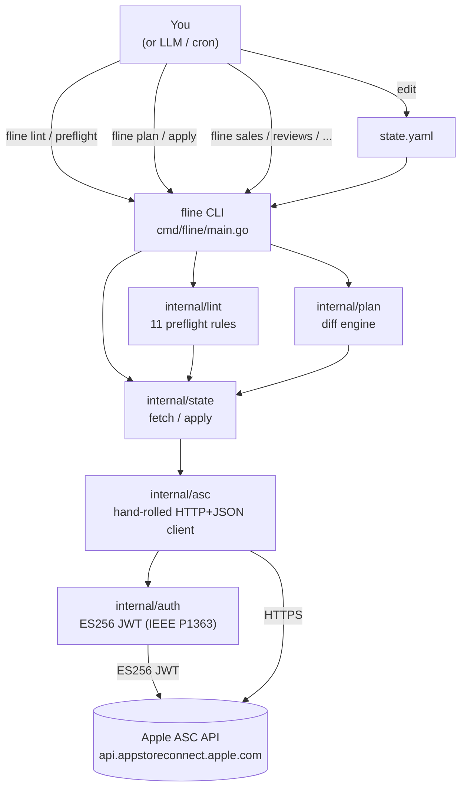

<div align="center">

# Flightline

**App Store as Code.**

The first declarative tool for App Store Connect — fetch live state, edit YAML, lint, plan, apply.

[](https://github.com/ul0gic/flightline/actions/workflows/ci.yml)
[](LICENSE)
[](https://pkg.go.dev/github.com/ul0gic/flightline)
[](https://goreportcard.com/report/github.com/ul0gic/flightline)
[](https://go.dev/doc/go1.26)

</div>

Like Terraform for cloud infrastructure or Pulumi for Kubernetes, Flightline manages your App Store presence as declarative state. A single Go binary that fetches live App Store Connect state into YAML, runs preflight checks against Apple's rejection rules, and applies changes idempotently. The same tool reads sales, analytics, reviews, subscription state, beta feedback, and performance metrics from the terminal. The ASC web UI becomes optional.

This is a personal tool open-sourced for sharing. No SaaS layer, no telemetry, no accounts. Just a binary that talks to Apple's API.

---

## Table of Contents

- [Why Flightline](#why-flightline)
- [Position](#position)
- [What it does today](#what-it-does-today-v050-beta)
- [Architecture](#architecture)
- [The lifecycle](#the-lifecycle)
- [Install](#install)
- [Setup](#setup)
- [Quickstart](#quickstart)
- [Commands by category](#commands-by-category)
- [Output](#output)
- [Configuration precedence](#configuration-precedence)
- [What it doesn't do](#what-it-doesnt-do)
- [Documentation](#documentation)
- [Building from source](#building-from-source)
- [Development](#development)
- [Status](#status)
- [License](#license)

---

## Why Flightline

Every other modern platform has "as Code" tooling: Terraform for cloud, Pulumi for Kubernetes, Crossplane for control planes, Helm for releases. The App Store doesn't. Until now.

Apple's App Store Connect has two failure modes that cost real time.

**Authoring failures.** Hundreds of fields scattered across a dozen surfaces — version metadata, IAPs, IAP review screenshots, age rating, export compliance, content rights, privacy nutrition labels, review notes, contact info, demo credentials, screenshot dimensions per device, per-locale localizations, build attachment, review submission item composition. Forget any one and the release gets bounced. Every rejection is a lost release cycle.

**Observation friction.** Sales, downloads, conversion, reviews, subscription churn, beta crashes, performance metrics — each on a different ASC web surface, none piped, none scriptable, none LLM-readable. You spend hours per week clicking through screens to answer "how is my app doing."

Flightline addresses both. The authoring half lets you declare release state in YAML next to your app source, diff it against live ASC state, and apply changes idempotently. The observation half gives you composable terminal commands you can pipe to `jq`, feed to LLM prompts, or cron-schedule as snapshots. Neither half is bonus — both are first-class.

---

## Position

Flightline slots into the established "as Code" lineage. Same shape: declarative state, idempotent reconciliation, drift detection, version control as the source of truth.

| Tool | Domain | "as Code" for |
|---|---|---|
| Terraform | AWS, GCP, Azure, on-prem | Infrastructure |
| Pulumi | Cloud + Kubernetes (general-purpose languages) | Infrastructure |
| Crossplane | Multi-cloud control planes | Resources |
| Helm | Kubernetes | Releases |
| **Flightline** | **App Store Connect** | **App Store** |

If you've used any of those, the workflow rhymes: `fetch` to capture live state, `plan` to diff, `apply` to converge. The substrate is different — Apple's API instead of a cloud — and the failure mode being prevented is App Store rejection rather than a bad cloud rollout, but the discipline is the same.

---

## What it does today (v0.5.0-beta)

All three layers are complete: L1 (API CLI), L2 (state-as-code), and L3 (preflight rules). The columns below split the management surface (L1 read/write CLI verbs) from the as-Code surface (L2 fetch/plan/apply) so you can see what's drivable from a `state.yaml` versus what's CLI-only.

| Surface | L1 read | L1 write | L2 state-as-code | L3 preflight rule |
|---|:---:|:---:|:---:|:---:|
| Apps | ✅ | — | — | — |
| Versions | ✅ | ✅ | ✅ | ✅ |
| Builds (incl. attach) | ✅ | ✅ | ✅ | ✅ |
| Metadata + localizations | ✅ | ✅ | ✅ | ✅ |
| Screenshots | ✅ | ✅ | ✅ ¹ | ✅ |
| IAPs (incl. review screenshot) | ✅ | ✅ | ✅ ¹ | ✅ (3 rules) |
| Age rating | ✅ | ✅ | ✅ | ✅ |
| Export compliance | ✅ | ✅ | ✅ | ✅ |
| Reviewer demo info | ✅ | ✅ | ✅ | — |
| Categories | ✅ | ✅ | ✅ | — |
| Pricing | ✅ | ✅ | ✅ | — |
| Custom product pages | ✅ | ✅ | ✅ ¹ | — |
| TestFlight (groups, testers, beta-review submit) | ✅ | ✅ | ✅ (partial) | ✅ |
| Subscription groups | ✅ | — ² | — ² | — |
| Review submissions (App Store Review) | ✅ | — ³ | — ³ | — |
| Customer reviews | ✅ | — ⁴ | — | — |
| Beta feedback (crash + screenshot) | ✅ | — | — | — |
| Diagnostic signatures | ✅ | — | — | — |
| Performance metrics | ✅ | — | — | — |
| Sales reports | ✅ | — | — | — |
| Finance reports | ✅ | — | — | — |
| Subscription reports | ✅ | — | — | — |
| Analytics reports | ✅ | — | — | — |
| Privacy nutrition labels | portal-only ⁵ | — | — | — |

¹ Asset uploads (screenshots, IAP review screenshots, CPP screenshots) flow through L1 verbs by design — `fline screenshots upload`, `fline iap review-screenshot upload`, `fline custom-product-pages screenshots upload`. Apple's multipart upload API (reserve → PUT → commit, often via a separate signed-URL host) is structurally distinct from JSON PATCH on a config field, so `apply` deliberately doesn't drive uploads — config fields converge through `apply`, asset bytes flow through the upload verbs. The two-command flow (`upload`, then `apply`) is the intended workflow.

² Subscriptions are read-only in v1 (`fline subscriptions list/get/reports`). Subscription writes (groups, products, prices, intro offers, promotional offers) are deferred — no near-term plan.

³ App Store Review submission (the actual "ship this version" verb) is **intentionally manual in v1**. `fline review-submissions list` and `fline review-submissions items` show submission state read-only; the create-and-submit flow happens in the ASC web portal. Rationale: review submission is a high-stakes, non-reversible action where double-checking in the portal is the safer default while the rest of the toolchain matures.

⁴ `fline reviews list/get/summary` is read-only. Replying to reviews is not implemented.

⁵ `appPrivacyDetails` is absent from ASC API v4.3. `fline privacy-labels get` returns a typed `supported: false` diagnostic explaining the gap rather than silently failing. Flightline will wire this when Apple adds the endpoint to the spec.
---

## Architecture

Flightline is a cobra subcommand tree backed by a hand-rolled HTTP+JSON client against Apple's API. There is no codegen — Apple's OpenAPI spec triggers cascading type-name collisions in every Go generator evaluated. The spec is committed as authoritative reference and queried via `jq` during development.



**Layer stack:**

```
L3 — preflight rules (internal/lint/) ─── catches clerical rejection causes
L2 — state-as-code  (internal/state/) ─── declare → diff → apply
L1 — API CLI        (internal/asc/)   ─── every ASC surface as a terminal command
```

Each layer is useful standalone. You can use `fline sales` and `fline reviews` without ever touching a `state.yaml`. You can use L2 without running preflight. L3 preflight can catch issues even if you manage writes manually.

---

## The lifecycle

### Authoring (stop getting rejected)

```mermaid
flowchart LR
    A["1. fetch\nread live state"] --> B["2. edit\nstate.yaml"]
    B --> C["3. lint\noffline check"]
    C --> D["4. plan\ndiff vs live"]
    D --> E["5. preflight\nlive rule check"]
    E --> F["6. apply --confirm\nidempotent writes"]
    F --> G["7. submit\ntestflight beta-review submit"]
    G --> H["8. rejection\ndiagnose if bounced"]

    classDef readonly fill:#e8f5e9,stroke:#388e3c,color:#1b5e20
    classDef write fill:#fff8e1,stroke:#f9a825,color:#3e2723
    classDef commit fill:#fce4ec,stroke:#c62828,color:#b71c1c

    class A,C,D,E,H readonly
    class B write
    class F,G commit
```



Steps 1–5 are read-only and reversible. Step 6 patches ASC but does not submit for review. Step 7 (the beta-review submit) is the only action that triggers Apple Review — it requires explicit confirmation.

### Observation (stop opening the web UI)

```bash
fline sales com.under5.passdmv --days 30
fline finance com.under5.passdmv --month 2026-04
fline subscriptions list com.under5.passdmv
fline reviews list com.under5.passdmv --rating 1 --rating 2 --rating 3
fline reviews summary com.under5.passdmv
fline analytics request com.under5.passdmv --wait
fline beta-feedback crash com.under5.passdmv
fline diagnostics list com.under5.passdmv
fline performance app com.under5.passdmv
```

All observation commands support `--output json` for piping to `jq` or feeding to LLM prompts.

---

## Install

```bash
brew install ul0gic/flightline/fline
```

macOS only. App Store Connect work requires a Mac, so that's where Flightline runs. Apple Silicon and Intel are both supported.

Verify the install:

```bash
fline --version
fline --help
```

Homebrew is the only supported install method for end users. For CI runners on Linux or air-gapped environments, pre-built `.tar.gz` binaries (`darwin/arm64`, `darwin/amd64`, `linux/amd64`) are attached to every [GitHub Release](https://github.com/ul0gic/flightline/releases). To compile from source, see [Building from source](#building-from-source).

> **Note:** Homebrew tap ships at v1.0.0. Until then, install via [Building from source](#building-from-source).

---

## Setup

Flightline talks to App Store Connect using an API key you generate in the developer portal. One-time setup, four steps.

### 1. Generate an API key

In a browser, go to https://appstoreconnect.apple.com/access/integrations/api and:

1. Click **+** to create a new key
2. Name it (e.g., `flightline`)
3. Grant role **App Manager** (or **Admin** if you also need finance reports)
4. Click **Generate**, then **Download API Key** — you can only download the `.p8` file once
5. Note the **Key ID** (10 characters, e.g., `ABCD1234EF`) and **Issuer ID** (UUID, e.g., `12345678-90ab-cdef-1234-567890abcdef`)

### 2. Install the key file

```bash
mkdir -p ~/.appstoreconnect
mv ~/Downloads/AuthKey_ABCD1234EF.p8 ~/.appstoreconnect/
chmod 600 ~/.appstoreconnect/AuthKey_ABCD1234EF.p8
```

Replace `ABCD1234EF` with your actual Key ID. Flightline refuses to load a `.p8` with permissions wider than `600` and prints the exact `chmod` command to fix it.

### 3. Export credentials

Add to `~/.zshrc` (or `~/.bashrc`):

```bash
export APP_STORE_CONNECT_KEY_ID="ABCD1234EF"
export APP_STORE_CONNECT_ISSUER_ID="12345678-90ab-cdef-1234-567890abcdef"
export APP_STORE_CONNECT_VENDOR_NUMBER="12345678"
```

The vendor number is required for sales and finance reports only. Reload your shell:

```bash
source ~/.zshrc
```

### 4. Verify auth

```bash
fline whoami
```

Expected output:

```
FIELD          VALUE
KEY_ID         ABCD1234EF
ISSUER_ID      12345678-90ab-cdef-1234-567890abcdef
VENDOR_NUMBER  12345678
AUTHORIZED     true
API_BASE_URL   https://api.appstoreconnect.apple.com
```

If `whoami` errors, the message will tell you what's wrong: missing env var, `.p8` not found, wrong permissions, or invalid key. The redacted error includes a hint pointing at the exact fix.

**Alternative configuration paths** (lower precedence than env vars):

- CLI flags: `--key-id`, `--issuer-id` on every command
- Config file: `~/.config/flightline/config.yaml`

See [Configuration precedence](#configuration-precedence) for the resolution order.

---

## Quickstart

Five commands that verify the install works and cover both pillars:

```bash
# Verify auth
fline whoami

# List your apps
fline apps list

# Inspect a version
fline versions get com.under5.passdmv --version 1.0

# Diagnose a rejection (if the version is in REJECTED state)
fline rejection com.under5.passdmv --version 1.0

# Run offline preflight against a state file
fline lint state.yaml
```

Replace `com.under5.passdmv` with your bundle ID. For the full state-as-code walkthrough (fetch → edit → plan → apply), see [docs/state-yaml-quickstart.md](docs/state-yaml-quickstart.md).

---

## Commands by category

### Authoring — manage release state

```bash
# Versions
fline versions list com.under5.passdmv
fline versions get com.under5.passdmv --version 1.1
fline versions create com.under5.passdmv --version 1.1 --copyright "2026 ..."
fline versions update com.under5.passdmv --version 1.1 --release-type MANUAL

# Metadata and localizations
fline metadata set com.under5.passdmv --version 1.1 \
  --locale en-US --name "PassDMV" --subtitle "..."

# Screenshots
fline screenshots upload com.under5.passdmv --version 1.1 \
  --display-type APP_IPHONE_69 --file ./screenshots/iphone.png

# IAPs
fline iap list com.under5.passdmv
fline iap create com.under5.passdmv --reference-name "Lifetime" \
  --product-id com.under5.passdmv.lifetime --type NON_CONSUMABLE

# Age rating and compliance
fline age-rating set com.under5.passdmv --version 1.1 --from-file rating.json
fline export-compliance set com.under5.passdmv --version 1.1 \
  --uses-non-exempt-encryption false

# Review submissions
fline review-submissions list com.under5.passdmv
fline review-submissions items com.under5.passdmv --submission <id>

# Diagnose a rejection
fline rejection com.under5.passdmv --version 1.1
```

### Observation — read account state

```bash
# Customer reviews
fline reviews list com.under5.passdmv --rating 1 --rating 2
fline reviews summary com.under5.passdmv

# Sales and finance reports
fline sales com.under5.passdmv --days 30
fline sales com.under5.passdmv --month 2026-04 --output json
fline finance com.under5.passdmv --month 2026-04

# Subscription reports
fline subscriptions list com.under5.passdmv
fline subscriptions reports com.under5.passdmv --type summary --range P30D

# Analytics (async — request, poll, download)
fline analytics request com.under5.passdmv --access-type ONE_TIME_SNAPSHOT --wait
fline analytics list-instances --report-id <id>
fline analytics download --instance <id> --out report.csv

# TestFlight feedback and crash diagnostics
fline beta-feedback crash com.under5.passdmv
fline beta-feedback screenshot com.under5.passdmv
fline diagnostics list com.under5.passdmv
fline diagnostics get com.under5.passdmv --signature <id>

# Performance metrics
fline performance app com.under5.passdmv
fline performance build com.under5.passdmv --build <id>
```

### State as Code — declare, diff, apply

```bash
# Snapshot live ASC state into a YAML file
fline fetch com.under5.passdmv > state.yaml

# Preview what would change (no writes)
fline plan state.yaml

# Apply changes idempotently (safe to re-run)
fline apply state.yaml --confirm

# Resume a partially-applied run after interruption
fline apply state.yaml --confirm --resume
```

See [docs/state-yaml.md](docs/state-yaml.md) for the full v1alpha1 schema reference and [docs/state-yaml-quickstart.md](docs/state-yaml-quickstart.md) for a step-by-step walkthrough.

### Preflight — catch rejections before they happen

```bash
# Offline: validates state.yaml against JSON Schema + format rules
fline lint state.yaml

# Live: reads ASC state, runs all 11 rules, reports pass/fail
fline preflight com.under5.passdmv --version 1.1

# Cross-check live state against a state file
fline preflight com.under5.passdmv --version 1.1 --state-file state.yaml

# JSON output for CI integration
fline preflight com.under5.passdmv --version 1.1 --output json | jq '.diagnostics'
```

See [docs/preflight-rules.md](docs/preflight-rules.md) for every rule with mode, severity, fix hints, and examples.

---

## Output

Every command supports `--output table` (default) and `--output json`.

```bash
fline apps list --output table
```

```
BUNDLE ID                  NAME         STATUS
com.under5.passdmv         PassDMV      READY_FOR_SALE
```

```bash
fline apps list --output json
```

```json
[
  {
    "bundleId": "com.under5.passdmv",
    "name": "PassDMV",
    "sku": "passdmv",
    "primaryLocale": "en-US"
  }
]
```

The JSON shape is a stable contract. Adding fields is backward-compatible; removing or renaming fields is a breaking change tracked by a major version bump. Sales and subscription commands additionally support `--output tsv` (passthrough from Apple's wire format).

---

## Configuration precedence

From highest to lowest priority:

1. CLI flags (`--key-id`, `--issuer-id`, etc.)
2. Environment variables (`APP_STORE_CONNECT_KEY_ID`, `APP_STORE_CONNECT_ISSUER_ID`, `APP_STORE_CONNECT_VENDOR_NUMBER`, `APP_STORE_CONNECT_KEY_PATH`, `FLINE_*`)
3. Config file (`~/.config/flightline/config.yaml`)
4. Defaults

**Config file example** (`~/.config/flightline/config.yaml`):

```yaml
key-id: ABCD1234EF
issuer-id: 12345678-90ab-cdef-1234-567890abcdef
vendor-number: "12345678"
output: table
```

---

## What it doesn't do

**Not Fastlane.** No pipeline DSL, no build orchestration. Flightline is the ASC config and reporting layer. `xcodebuild`, Xcode Cloud, and Fastlane still own compilation, signing, and binary upload.

**Not a build tool.** Flightline doesn't compile, archive, or upload `.ipa` files. You point a build at a version with `builds attach`; Flightline handles everything from that point forward.

**Not a screenshot generator.** Flightline uploads screenshots you provide via `screenshots upload`.

**Not a SaaS.** No backend, no telemetry, no accounts. The binary talks directly to Apple's API using your credentials.

**Not the App Store Review submit button — by design.** Flightline preps everything that goes into a submission (build attach, metadata, screenshots, IAPs, age rating, export compliance, demo creds), and `fline preflight` will tell you whether the version is submission-ready, but the final "Submit for Review" click happens in the ASC web portal. Review submission is high-stakes and non-reversible; keeping the human-in-the-loop step in the portal where you can also see the full submission summary is the safer default for v1. May be wired as `fline review-submissions submit` in a later version once the rest of the toolchain has more real-world miles on it.

**Three portal-only surfaces** — Apple's public API does not expose these. Flightline tells you explicitly when you hit them rather than silently failing:

- **Resolution-center reviewer messages** — the rejection text written by Apple's reviewers is not in the v4.3 API. `fline rejection` reports every API-visible state field and tells you to check the portal for the actual message.
- **Privacy nutrition labels** (`appPrivacyDetails`) — entirely absent from ASC API v4.3. `fline privacy-labels get` returns a typed `supported: false` diagnostic. Flightline will wire this when Apple adds the endpoint to the spec.
- **App Store Review submission** (covered above) — wired as a deliberate human-in-the-loop step, not an API gap.

---

## Documentation

| Document | What it covers |
|---|---|
| [docs/state-yaml.md](docs/state-yaml.md) | Full v1alpha1 reference: every field, type, constraint, and gotcha |
| [docs/state-yaml-quickstart.md](docs/state-yaml-quickstart.md) | Fetch → edit → plan → apply walkthrough using passdmv |
| [docs/preflight-rules.md](docs/preflight-rules.md) | All 11 preflight rules + submission-checklist items Apple's API doesn't expose |

---

## Building from source

Requires Go 1.26 or later.

### Clone and build

```bash
git clone https://github.com/ul0gic/flightline.git
cd flightline
make build
./bin/fline --version
```

The binary is at `./bin/fline`. Move it onto your `PATH` if you want it system-wide:

```bash
sudo mv ./bin/fline /usr/local/bin/fline
```

### Or via `go install`

```bash
go install github.com/ul0gic/flightline/cmd/fline@latest
```

The binary lands in `$GOBIN` (typically `~/go/bin`). Make sure `~/go/bin` is on your `PATH`.

---

## Development

```bash
make build    # produces ./bin/fline
make test     # go test ./... -race
make vet      # go vet ./...
make lint     # golangci-lint run
make verify   # vet + test + lint (the gate)
make fmt      # gofmt -s -w . && goimports -w .
make clean    # remove ./bin and coverage artifacts
```

**Architecture decisions** live in `.project/` (gitignored — internal scaffolding). The design rationale for the hand-rolled API client instead of codegen, the JWT IEEE P1363 requirement, the async-poll state persistence model, and every other non-obvious choice are documented there.

**Adding a command:** query `openapi.oas.json` with `jq` for the endpoint shape, add a file under `internal/asc/` for the client function, add a file under `internal/cmd/` for the cobra command, add a golden fixture under `internal/asc/testdata/golden/`. See existing files for the pattern — it is consistent throughout.

**Tests:** unit tests for all command logic, HTTP fixture replay tests for the client (captured Apple responses replayed via a local server), integration tests behind `//go:build integration`. Run `make test` before any commit.

---

## Status

v0.5.0-beta. L1 (full API CLI, both authoring and observation pillars), L2 (state-as-code with fetch/plan/apply), and L3 (11 preflight rules) are all complete.

Next milestone is v1.0.0: GoReleaser distribution, Homebrew tap, and retiring the legacy Node CLI.

Personal hack, open-sourced under MIT. Maintained by [ul0gic](https://github.com/ul0gic). Issues and PRs welcome — cadence is evenings and weekends, not a funded project.

---

## License

MIT — see [LICENSE](LICENSE).
