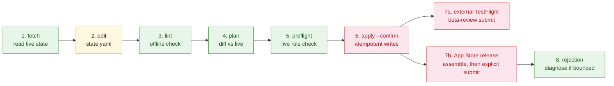
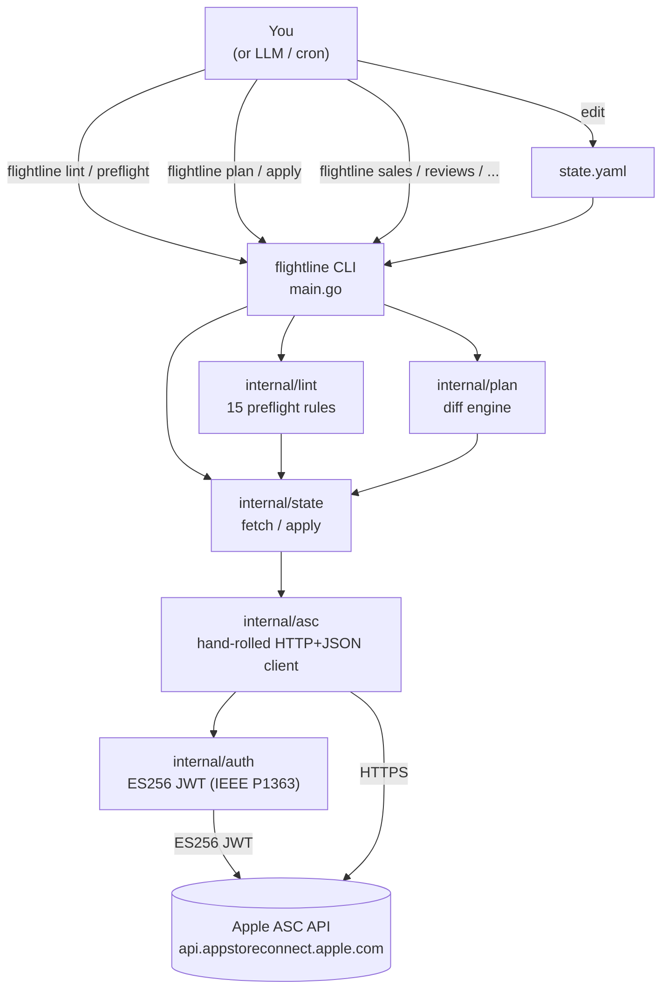

<div align="center">

# Flightline

**Terraform-style reconciliation and rejection preflight for App Store Connect.**

Fetch live state, review an exact plan, apply idempotently, and prove convergence with an empty plan.

[](https://github.com/ul0gic/flightline/actions/workflows/ci.yml)
[](LICENSE)
[](https://pkg.go.dev/github.com/ul0gic/flightline)
[](https://goreportcard.com/report/github.com/ul0gic/flightline)
[](https://go.dev/doc/go1.26)

</div>

Like Terraform for cloud infrastructure, Flightline reconciles declared release state against live App Store Connect state. A single Go binary fetches ASC into YAML, shows a reviewable plan, applies changes idempotently, and runs preflight checks against known rejection classes. The same tool reads sales, analytics, reviews, subscription state, beta feedback, and performance metrics from the terminal. Explicit manual fallbacks remain for actions Apple's public API does not expose or Flightline intentionally does not submit yet.

MIT licensed, contributions welcome ([CONTRIBUTING.md](CONTRIBUTING.md)). No SaaS layer, no telemetry, no accounts. Just a binary that talks to Apple's API.

---

## Table of Contents

- [Install](#install)
- [Setup](#setup)
- [Quickstart](#quickstart)
- [Why Flightline](#why-flightline)
- [The lifecycle](#the-lifecycle)
- [What it does today](#what-it-does-today)
- [Architecture](#architecture)
- [Commands by category](#commands-by-category)
- [Output](#output)
- [Configuration precedence](#configuration-precedence)
- [What it doesn't do](#what-it-doesnt-do)
- [Documentation](#documentation)
- [Development](#development)
- [Status](#status)
- [License](#license)

---

## Install

```bash
go install github.com/ul0gic/flightline@latest
```

Requires Go 1.26+. App Store Connect work requires a Mac, so that's where Flightline is meant to run (Apple Silicon and Intel both supported); the binary itself builds anywhere Go does.

Verify:

```bash
flightline --version
```

To compile from a checkout instead:

```bash
git clone https://github.com/ul0gic/flightline.git
cd flightline
make build
./bin/flightline --version
```

`go install` is the install method — a single static binary, no package manager needed. Full details in [docs/getting-started/install.md](docs/getting-started/install.md).

---

## Setup

Flightline authenticates with an App Store Connect API key (a `.p8` private key it signs an ES256 JWT with), not your Apple ID. One-time setup:

1. **Generate a key.** App Store Connect > Users and Access > Integrations > App Store Connect API > **+**. Grant role **App Manager** (or **Admin** for finance reports). Click **Generate**, then **Download API Key**: the `.p8` downloads only once. Note the **Key ID** and **Issuer ID**.
2. **Place the key.** Move it to `~/.appstoreconnect/AuthKey_<KEY_ID>.p8` and `chmod 600` it. Flightline refuses a `.p8` with wider permissions and prints the exact fix.
3. **Export credentials.** In `~/.zshrc` (or `~/.bashrc`):

   ```bash
   export APP_STORE_CONNECT_KEY_ID="ABCD1234EF"
   export APP_STORE_CONNECT_ISSUER_ID="12345678-90ab-cdef-1234-567890abcdef"
   export APP_STORE_CONNECT_VENDOR_NUMBER="12345678"   # sales/finance only
   ```

4. **Verify.** Run `flightline whoami`; `AUTHORIZED true` means you are set.

Full walkthrough (roles, 401/403 troubleshooting, flag and config-file alternatives): [docs/getting-started/apple-api-key.md](docs/getting-started/apple-api-key.md).

---

## Quickstart

```bash
# Verify auth
flightline whoami

# List your apps
flightline apps list

# Inspect a version
flightline versions get app.tideterm.ios --version 1.0

# Diagnose a rejection (if the version is in REJECTED state)
flightline rejection app.tideterm.ios --version 1.0

# Run offline preflight against a state file
flightline lint state.yaml
```

Replace `app.tideterm.ios` with your bundle ID. For the full fetch, edit, plan, apply walkthrough, see [docs/guides/state-as-code.md](docs/guides/state-as-code.md).

---

## Why Flightline

File-based App Store metadata is established tooling: Fastlane Deliver has supported it for years. Flightline focuses on the missing control loop around that metadata: fetch live state, calculate an exact diff, apply it, and use an empty follow-up plan as proof of convergence. Its preflight engine adds checks learned from real rejection classes.

| Tool | Domain | "as Code" for |
|---|---|---|
| Terraform | AWS, GCP, Azure, on-prem | Infrastructure |
| Pulumi | Cloud + Kubernetes | Infrastructure |
| Helm | Kubernetes | Releases |
| Fastlane Deliver | App Store Connect | Metadata files and delivery automation |
| **Flightline** | **App Store Connect** | **Live reconciliation and rejection preflight** |

App Store Connect has two failure modes that cost real time.

**Authoring failures.** Hundreds of fields scattered across a dozen surfaces: version metadata, IAPs, review screenshots, age rating, export compliance, privacy labels, demo credentials, per-locale localizations, build attachment. Forget any one and the release gets bounced. Every rejection is a lost release cycle.

**Observation friction.** Sales, reviews, subscription churn, beta crashes, performance metrics, each on a different ASC web surface, none piped, none scriptable.

Flightline addresses both. The authoring half lets you declare release state in YAML next to your app source, diff it against live ASC state, and apply changes idempotently. The observation half gives you composable terminal commands you can pipe to `jq`, feed to LLM prompts, or cron-schedule as snapshots.

---

## The lifecycle

### Authoring (stop getting rejected)


```mermaid
flowchart LR
    A["1. fetch\nread live state"] --> B["2. edit\nstate.yaml"]
    B --> C["3. lint\noffline check"]
    C --> D["4. plan\ndiff vs live"]
    D --> E["5. preflight\nlive rule check"]
    E --> F["6. apply --confirm\nidempotent writes"]
    F --> G["7a. external TestFlight\nbeta-review submit"]
    F --> H["7b. App Store release\nassemble, then explicit submit"]
    H --> I["8. rejection\ndiagnose if bounced"]

    classDef readonly fill:#e8f5e9,stroke:#388e3c,color:#1b5e20
    classDef write fill:#fff8e1,stroke:#f9a825,color:#3e2723
    classDef commit fill:#fce4ec,stroke:#c62828,color:#b71c1c

    class A,C,D,E,I readonly
    class B write
    class F,G,H commit
```

Steps 1 to 5 are read-only against ASC and reversible. Step 6 patches ASC but does not submit anything for review. From there the workflows split: `testflight beta-review submit` requests Beta App Review for external TestFlight distribution only; it does not submit an App Store release. For production, `submission-assembly plan` verifies the selected version and item proposals; `assemble --confirm` creates or resumes a draft with exact membership. The separate `submit --confirm` command reruns preflight and membership checks before requesting App Store Review. Submit for Review in ASC remains an alternative. Generic state apply never performs this final action.

### Observation (stop opening the web UI)

```bash
flightline sales app.tideterm.ios --days 30
flightline finance app.tideterm.ios --month 2026-04
flightline reviews summary app.tideterm.ios
flightline analytics request app.tideterm.ios --wait
flightline beta-feedback crash app.tideterm.ios
flightline performance app app.tideterm.ios
```

All observation commands support `--output json` for piping to `jq` or feeding to LLM prompts.

---

## What it does today

Implemented coverage spans L1 (API CLI), L2 (state-as-code), and L3 (preflight rules). The table describes selected workflows, not every operation in an API resource family. New corrections are locally verified; live qualification is recorded separately.

| Surface | L1 read | L1 write | L2 state-as-code | L3 preflight rule |
|---|:---:|:---:|:---:|:---:|
| Apps | ✅ | - | - | - |
| Versions | ✅ | ✅ | ✅ | ✅ |
| Builds (incl. attach) | ✅ | ✅ | ✅ | ✅ |
| Metadata + localizations | ✅ | ✅ | ✅ | ✅ |
| Screenshots (including explicit ordering) | ✅ | ✅ | ✅ | ✅ |
| Preview videos (main / CPP) | ✅ | ✅ | ✅ | Intent validation |
| App Review attachments | ✅ | ✅ | - | - |
| Content rights / custom EULA | ✅ | ✅ | ✅ | Intent validation |
| IAPs (metadata, review screenshot) | ✅ | ✅ | ✅ | ✅ (3 rules) |
| IAP commerce (price, territories) | ✅ | ✅ | ✅ | Intent validation |
| IAP promotional images / promoted purchases | ✅ | ✅ (explicit actions) | - | - |
| IAP offer codes | ✅ | ✅ (explicit issuance) | - | - |
| App availability / preorders | ✅ | Partial (active preorders) | Partial (existing preorder territories) | Intent validation |
| Age rating | ✅ | ✅ | ✅ | ✅ |
| Export compliance | ✅ | ✅ | ✅ | ✅ |
| Reviewer demo info | ✅ | ✅ | ✅ | - |
| Categories | ✅ | ✅ | ✅ | - |
| Pricing | ✅ | ✅ | ✅ | - |
| Custom product pages | ✅ | ✅ | ✅ | - |
| TestFlight groups, testers, beta-review submit | ✅ | ✅ | ✅ (partial) | ✅ |
| TestFlight metadata and build membership | ✅ | ✅ | ✅ | Intent validation |
| Beta auto-notify / notifications / recruitment | ✅ | Policy, explicit notification | - | - |
| Subscription groups | ✅ | - ¹ | - ¹ | - |
| Review submissions (App Store Review) | ✅ | ✅ (explicit assembly/submit) ² | - | Fresh preflight |
| In-app events / product page experiments | ✅ | ✅ (selected workflows, item proposals) | - | - |
| Phased release | ✅ | ✅ (enable/pause/resume) | ✅ (bounded transitions) | Intent validation |
| Manual version release | ✅ | ✅ (explicit action) | - | - |
| Webhooks / deliveries | ✅ | ✅ (confirmed actions) | - | - |
| Customer reviews / responses | ✅ | ✅ (confirmed responses) | - | - |
| Beta feedback (crash + screenshot) | ✅ | - | - | - |
| Diagnostic signatures | ✅ | - | - | - |
| Performance metrics + overview | ✅ | - | - | - |
| App tags | ✅ | ✅ (visibility) | - | - |
| Accessibility declarations | ✅ | ✅ (drafts, explicit publish/delete) | ✅ (draft answers) | Intent validation |
| Sales reports | ✅ | - | - | - |
| Finance reports | ✅ | - | - | - |
| Subscription reports | ✅ | - | - | - |
| Analytics reports | ✅ | - | - | - |
| Privacy nutrition labels | portal-only ⁴ | - | - | - |

Commercial/beta limits: ordinary app-availability mutations, preorder creation, invitation resend, and recruitment-criteria writes remain unsupported or unqualified. Offer-code issuance, preorder release, and beta notifications are explicit commands, never automatic reconciliation.

State write limits: IAP type and content hosting are not mutable; export declaration documents and approval steps are unsupported. Pricing changes preserve verified manual windows and require a valid territory/price-point pair. Dry-run reports validated planned changes, not applied changes.

¹ Subscriptions are read-only for now. Subscription writes are deferred, with no near-term plan.

² Submission assembly and final submit are separate confirmed commands. The selected workflow requires an app version; subscription, Game Center, CPP and background-asset submission items are excluded. IAP-version attachment and campaign lifecycle operations are locally tested but await controlled live qualification.

Review responses are app-scoped explicit actions. Replacing text requires a separate confirmed delete; Flightline never silently deletes and recreates a reply.

⁴ `appPrivacyDetails` is absent from ASC API v4.5. `flightline privacy-labels get` returns a typed `supported: false` diagnostic rather than silently failing.

---

## Architecture

Flightline is a cobra subcommand tree backed by a hand-rolled HTTP+JSON client against Apple's API. There is no codegen: Apple's OpenAPI spec triggers cascading type-name collisions in every Go generator evaluated. The spec is committed as authoritative reference and queried via `jq` during development. The pinned version and refresh procedure are documented in [API compatibility](docs/reference/api-compatibility.md).


```mermaid
flowchart TB
    User["You\n(or LLM / cron)"]
    YAML["state.yaml"]
    CLI["flightline CLI\nmain.go"]
    Lint["internal/lint\n15 preflight rules"]
    Plan["internal/plan\ndiff engine"]
    State["internal/state\nfetch / apply"]
    ASC["internal/asc\nhand-rolled HTTP+JSON client"]
    Auth["internal/auth\nES256 JWT (IEEE P1363)"]
    Apple[("Apple ASC API\napi.appstoreconnect.apple.com")]

    User -->|"edit"| YAML
    User -->|"flightline lint / preflight"| CLI
    User -->|"flightline plan / apply"| CLI
    User -->|"flightline sales / reviews / ..."| CLI
    YAML --> CLI
    CLI --> Lint
    CLI --> Plan
    CLI --> State
    Lint --> State
    Plan --> State
    State --> ASC
    ASC --> Auth
    Auth -->|"ES256 JWT"| Apple
    ASC -->|"HTTPS"| Apple
```

**Layer stack:**

```
L3: preflight rules (internal/lint/)  ... catches clerical rejection causes
L2: state-as-code   (internal/state/) ... declare, diff, apply
L1: API CLI         (internal/asc/)   ... every ASC surface as a terminal command
```

Each layer is useful standalone. You can use `flightline sales` and `flightline reviews` without ever touching a `state.yaml`, and L3 preflight catches issues even if you manage writes manually.

---

## Commands by category

### Authoring: manage release state

```bash
# Versions
flightline versions list app.tideterm.ios
flightline versions create app.tideterm.ios --version 1.1 --copyright "2026 ..."
flightline versions update app.tideterm.ios --version 1.1 --release-type MANUAL

# Metadata and localizations
flightline metadata set app.tideterm.ios --version 1.1 \
  --locale en-US --name "PassDMV" --subtitle "..."

# Screenshots
flightline screenshots upload app.tideterm.ios --version 1.1 \
  --locale en-US --device-set APP_IPHONE_67 ./screenshots/iphone.png

# IAPs
flightline iap create app.tideterm.ios --name "Lifetime" \
  --product-id app.tideterm.ios.lifetime --type NON_CONSUMABLE

# Age rating and compliance
flightline age-rating set app.tideterm.ios --version 1.1 --from-file rating.json
flightline export-compliance set app.tideterm.ios --version 1.1 \
  --uses-non-exempt-encryption false

# Review submission inspection and rejection diagnosis
flightline review-submissions items app.tideterm.ios --submission <id>
flightline rejection app.tideterm.ios --version 1.1
```

### Observation: read account state

```bash
# Customer reviews
flightline reviews list app.tideterm.ios --rating 1..2
flightline reviews summary app.tideterm.ios

# Sales, finance, and subscription reports
flightline sales app.tideterm.ios --days 30
flightline finance app.tideterm.ios --month 2026-04
flightline subscriptions reports app.tideterm.ios --type summary --range P30D

# Analytics (async: request, poll, download)
flightline analytics request app.tideterm.ios --access-type ONE_TIME_SNAPSHOT --wait
flightline analytics download app.tideterm.ios --instance <id> --out ./reports

# TestFlight feedback, crash diagnostics, performance
flightline beta-feedback crash app.tideterm.ios
flightline diagnostics list app.tideterm.ios
flightline performance app app.tideterm.ios
```

### State as Code: declare, diff, apply

```bash
# Snapshot live ASC state into a YAML file
flightline fetch app.tideterm.ios > state.yaml

# Preview what would change (no writes)
flightline plan state.yaml

# Apply changes idempotently (safe to re-run)
flightline apply state.yaml --confirm

# Resume a partially-applied run after interruption
flightline apply state.yaml --confirm --resume
```

Schema reference: [docs/reference/state-yaml.md](docs/reference/state-yaml.md). Walkthrough: [docs/guides/state-as-code.md](docs/guides/state-as-code.md).

### Preflight: catch rejections before they happen

```bash
# Offline: validates state.yaml against JSON Schema + format rules
flightline lint state.yaml

# Live: reads ASC state, runs all 15 rules, reports pass/fail
flightline preflight app.tideterm.ios --version 1.1

# Cross-check live state against a state file
flightline preflight app.tideterm.ios --version 1.1 --state-file state.yaml

# JSON output for CI integration
flightline preflight app.tideterm.ios --version 1.1 --output json | jq '.diagnostics'
```

Every rule with mode, severity, and fix hints: [docs/reference/preflight-rules.md](docs/reference/preflight-rules.md).

---

## Output

Every command supports `--output table` (default) and `--output json`. The one
exception is `fetch`: it exists to produce a state file, so it defaults to YAML
and `-o state.yaml` needs no extra flags — authoring commands default to YAML,
reporting commands default to table.

Commands take the app as a positional argument — no `--app` flag anywhere.
Either identifier works: the bundle ID (`com.example.myapp`) or the numeric
App Store ID (`6762067669`).

```bash
flightline apps list --output table
```

```
BUNDLE_ID             NAME     SKU       ID
app.tideterm.ios      PassDMV  tideterm  6762067669
```

```bash
flightline apps list --output json
```

```json
{
  "apps": [
    {
      "id": "6762067669",
      "type": "apps",
      "attributes": {
        "bundleId": "app.tideterm.ios",
        "name": "PassDMV",
        "sku": "tideterm",
        "primaryLocale": "en-US"
      }
    }
  ]
}
```

The JSON shape is a stable contract. Adding fields is backward-compatible; removing or renaming fields is a breaking change tracked by a major version bump. Sales and subscription commands additionally support `--output tsv` (passthrough from Apple's wire format).

---

## Configuration precedence

From highest to lowest priority:

1. CLI flags (`--key-id`, `--issuer-id`, etc.)
2. Environment variables (`APP_STORE_CONNECT_KEY_ID`, `APP_STORE_CONNECT_ISSUER_ID`, `APP_STORE_CONNECT_VENDOR_NUMBER`, `APP_STORE_CONNECT_KEY_PATH`, `FLIGHTLINE_*`)
3. Config file (`~/.config/flightline/config.yaml`)
4. Defaults

**Config file example** (`~/.config/flightline/config.yaml`):

```yaml
key-id: ABCD1234EF
issuer-id: 12345678-90ab-cdef-1234-567890abcdef
vendor-number: "12345678"
output: table
```

---

## What it doesn't do

**Complementary to Fastlane.** Flightline has no pipeline DSL or build orchestration. `xcodebuild`, Xcode Cloud, and Fastlane still own compilation, signing, binary upload, and established metadata-file workflows. Flightline's distinct job is live-state reconciliation, reviewable plans, convergence checks, preflight rules, and rejection diagnosis across the ASC surfaces it supports.

**Not a screenshot generator.** Flightline uploads screenshots you provide.

**Not a SaaS.** No backend, no telemetry, no accounts. The binary talks directly to Apple's API using your credentials.

**No implicit submission or release.** State apply does not submit an App Store release. `submission-assembly assemble --confirm` prepares exact draft membership; `submission-assembly submit --confirm` is a separate final action with fresh preflight and membership checks. Manual version release, phased transitions, review replies and webhook actions also have their own explicit command boundaries.

**Two portal-only surfaces.** Apple's public API does not expose these, and Flightline tells you explicitly when you hit them:

- **Resolution-center reviewer messages:** the rejection text written by Apple's reviewers is not in the v4.5 API. `flightline rejection` reports every API-visible state field and tells you to check the portal for the actual message.
- **Privacy nutrition labels** (`appPrivacyDetails`): entirely absent from ASC API v4.5. `flightline privacy-labels get` returns a typed `supported: false` diagnostic.

---

## Documentation

| Document | What it covers |
|---|---|
| [docs/getting-started/install.md](docs/getting-started/install.md) | Install via `go install` or from source |
| [docs/getting-started/apple-api-key.md](docs/getting-started/apple-api-key.md) | Full API key setup: generate, place the `.p8`, export env vars, verify |
| [docs/getting-started/first-run.md](docs/getting-started/first-run.md) | Inspect an app, fetch a snapshot, lint, and preview changes |
| [docs/guides/state-as-code.md](docs/guides/state-as-code.md) | Fetch, edit, plan, apply walkthrough |
| [docs/guides/uploading-assets.md](docs/guides/uploading-assets.md) | Screenshots, previews, review attachments, and recovery |
| [Submission and release](docs/guides/submission-and-release.md) | Plan exact membership, assemble a draft, submit explicitly, and control release. |
| [IAP commerce](docs/guides/iap-commerce.md) | Manage products, selected pricing and availability, offers, and purchase actions. |
| [TestFlight](docs/guides/testflight.md) | Manage beta metadata, groups, builds, testers, and external review. |
| [In-app events](docs/guides/events.md) | Author events, localizations and media, then prepare submission proposals. |
| [Product-page experiments](docs/guides/experiments.md) | Manage experiments, treatments and assets with explicit lifecycle boundaries. |
| [Declarations](docs/guides/declarations.md) | Manage rights, EULA, accessibility, tags, and declaration boundaries. |
| [Reviews and webhooks](docs/guides/review-responses-and-webhooks.md) | Manage customer review responses and app-scoped webhook delivery workflows. |
| [Capabilities](docs/reference/capabilities.md) | Workflow coverage and qualification boundaries |
| [docs/reference/state-yaml.md](docs/reference/state-yaml.md) | Full v1alpha1 schema reference |
| [docs/reference/preflight-rules.md](docs/reference/preflight-rules.md) | All 15 preflight rules + submission-checklist items |
| [docs/reference/cli.md](docs/reference/cli.md) | Command-group index |
| [docs/concepts/three-layer-model.md](docs/concepts/three-layer-model.md) | How L1, L2, and L3 fit together |

---

## Development

```bash
make build    # produces ./bin/flightline
make test     # go test ./... -race
make lint     # golangci-lint run
make verify   # vet + test + lint (the gate)
make fmt      # gofmt -s -w . && goimports -w .
```

**Adding a command:** query `openapi.oas.json` with `jq` for the endpoint shape, add a client function under `internal/asc/`, a cobra command under `internal/cmd/`, and a golden fixture under `internal/asc/testdata/golden/`. The pattern is consistent throughout.

**Tests:** unit tests for command logic, HTTP fixture replay tests for the client, integration tests behind `//go:build integration`. Run `make test` before any commit.

---

## Status

Flightline implements selected ASC commands (L1), desired-state reconciliation (L2), and 15 preflight rules (L3). Coverage and limitations are listed above. The correction workflows are verified locally against fixtures; controlled live qualification remains pending. Releases are cut by tagging `v*` on GitHub — the release pipeline builds, signs, and publishes binaries with an SBOM automatically.

**Versioning policy (pre-1.0):** breaking changes to flags, JSON output, or exit codes can happen between minor versions (0.5 → 0.6), are always flagged in a `### Breaking` section of the release notes, and never happen in patch releases. 1.0 locks the contract.

Maintained by [ul0gic](https://github.com/ul0gic). Contributions welcome: read [CONTRIBUTING.md](CONTRIBUTING.md) first. Cadence is evenings and weekends, so reviews may take a few days.

---

## License

MIT. See [LICENSE](LICENSE).
