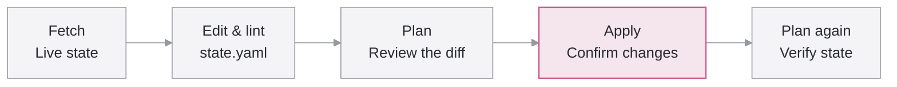

<div align="center">

# Flightline

**App Store as code.**

Manage App Store configuration in YAML. Review the diff. Apply your changes.
Submit from your terminal, and read sales, analytics and customer reviews with the same CLI.

[Website](https://flightline.dev) · [Install](https://flightline.dev/docs/getting-started/install) · [Documentation](https://flightline.dev/docs) · [Features](https://flightline.dev/features)

[](https://github.com/ul0gic/flightline/actions/workflows/ci.yml)
[](LICENSE)

</div>

Flightline is a single Go binary that talks directly to App Store Connect using your API key. No SaaS account, hosted backend or telemetry.

## Get started

Follow the [installation guide](https://flightline.dev/docs/getting-started/install), [set up your Apple API key](https://flightline.dev/docs/getting-started/apple-api-key), then [run your first commands](https://flightline.dev/docs/getting-started/first-run).

## From live state to reviewed changes

Fetch your app's current configuration into `state.yaml`, edit the fields you want to manage, and inspect the proposed changes before applying them.


```mermaid
flowchart LR
    fetch["Fetch<br/>Live state"] --> edit["Edit & lint<br/>state.yaml"]
    edit --> plan["Plan<br/>Review the diff"]
    plan --> apply["Apply<br/>Confirm changes"]
    apply --> verify["Plan again<br/>Verify state"]

    classDef neutral fill:#f4f4f6,stroke:#9799a1,color:#292b30,stroke-width:1px
    classDef confirmed fill:#f5e5ec,stroke:#cc5b8d,color:#292b30,stroke-width:1.5px
    class fetch,edit,plan,verify neutral
    class apply confirmed
    linkStyle default stroke:#9799a1,stroke-width:1px
```

After setup, use an existing editable version of your app:

```bash
flightline fetch com.example.app --version 1.0 --platform IOS -o state.yaml
# Edit state.yaml, then check the file and review the live diff.
flightline lint state.yaml
flightline plan state.yaml
```

When the plan matches your intent, `flightline apply state.yaml --confirm` writes the supported changes. Run `flightline plan state.yaml` again to check for remaining differences. Omitted surfaces stay unmanaged.

See the [state-as-code walkthrough](https://flightline.dev/docs/guides/state-as-code) for collection handling, asset uploads and interrupted runs.

## What you can do

- **Configure your listing.** Manage supported metadata, localizations, screenshots, previews, pricing and declarations in YAML.
- **Manage release workflows.** Work with TestFlight, in-app purchases, events and product-page experiments through dedicated commands.
- **Prepare and submit.** Run preflight checks, assemble a review draft, and submit it with a separate confirmed action.
- **Read your reports.** Query sales, finance, analytics, customer reviews, beta feedback and performance metrics. Use JSON output in scripts and CI.

The [features page](https://flightline.dev/features) explains the workflows. The [capabilities reference](https://github.com/ul0gic/flightline/blob/main/docs/reference/capabilities.md) lists supported operations and their limits.

## Submission stays explicit

Applying YAML never submits an App Store release. Draft assembly and final submission are separate confirmed actions. Submit for Review in ASC remains available. Beta App Review for external TestFlight is a separate workflow from production App Store Review. Preflight checks do not guarantee Apple approval.

Keep using Xcode, Xcode Cloud or Fastlane for building, signing and uploading binaries. Fastlane Deliver also supports metadata-file workflows; Flightline adds live-state comparison and reviewed changes across its supported surfaces. Privacy nutrition labels and Resolution Center messages stay in the portal. Subscription writes and Game Center authoring are not supported.

See [submission and release](https://github.com/ul0gic/flightline/blob/main/docs/guides/submission-and-release.md) for the full sequence.

## Documentation

- [CLI reference](https://flightline.dev/docs/reference/cli): commands, flags and examples.
- [YAML reference](https://flightline.dev/docs/reference/state-yaml): fields and write behavior.
- [Reports and analytics](https://flightline.dev/docs/guides/observability): query and download reports.
- [Preflight in CI](https://flightline.dev/docs/guides/preflight-in-ci): automate release checks.

## Contributing

See [CONTRIBUTING.md](CONTRIBUTING.md) for local builds, tests and pull requests. Report bugs through [Issues](https://github.com/ul0gic/flightline/issues) or ask questions in [Discussions](https://github.com/ul0gic/flightline/discussions).

Flightline is pre-1.0. Breaking changes may occur in minor releases and are called out in the [release notes](https://github.com/ul0gic/flightline/releases).

Maintained by [ul0gic](https://github.com/ul0gic). Licensed under [MIT](LICENSE).
